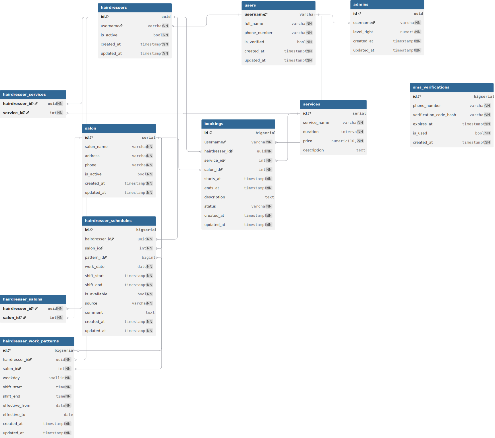

<div align="center">

# 💇 Hairdress Arzamas 52

**Бэкенд-платформа для управления салоном красоты в Арзамасе**


</div>

---

## 📋 О проекте

**Hairdress Arzamas 52** — это полнофункциональная платформа для автоматизации работы парикмахерской сети в Арзамасе. Система состоит из двух микросервисов:

| Сервис | Язык | Назначение |
|--------|------|------------|
| **Go Backend** | Go 1.26 | Клиентский API (gRPC + REST via grpc-gateway) |
| **Python Admin** | Python 3.12 / FastAPI | Административная CRUD-панель |

Оба сервиса работают с единой PostgreSQL-базой данных и используют Redis для кэширования и верификации.

---

## 🏗 Архитектура

```
┌──────────────┐     gRPC/HTTP      ┌──────────────────┐
│   Mobile/Web │ ◄─────────────────► │   Go Backend     │
│   Clients    │                     │  (gRPC + Gateway) │
└──────────────┘                     └────────┬─────────┘
                                              │
                    ┌─────────────────────────┼─────────────────────────┐
                    │                         │                         │
                    ▼                         ▼                         ▼
           ┌──────────────┐          ┌──────────────┐          ┌──────────────┐
           │  PostgreSQL  │          │    Redis     │          │    MinIO     │
           │  (Database)  │◄────────┤  (Cache +     │          │  (Avatars)   │
           │              │         │   OTP Store)  │          │              │
           └──────┬───────┘         └──────────────┘          └──────────────┘
                  │
                  ▼
           ┌──────────────┐
           │ Python Admin │
           │  (FastAPI)   │
           └──────────────┘
```

### 🔑 Ключевые возможности Go Backend

- **Регистрация и аутентификация** — по username, email или номеру телефона
- **OTP-верификация** — 6-значные коды через SMS (SMS.ru) или Email (SMTP)
- **PASETO-токены** — access token (15 мин) + refresh token (7 дней)
- **Rate Limiting** — защита от перебора кодов и брутфорса
- **Управление сессиями** — детектирование подозрительной активности
- **Загрузка аватаров** — через S3-совместимое MinIO хранилище

### 🔑 Ключевые возможности Python Admin

- Полноценное CRUD-управление всеми сущностями
- Административная панель с разделением уровней доступа
- Автоматические миграции через Alembic

---

## 🗄 База данных

<details>
<summary><b>Схема базы данных</b> (нажмите, чтобы развернуть)</summary>



</details>

| Таблица | Назначение |
|---------|------------|
| `users` | Пользователи (клиенты, парикмахеры, админы) |
| `sessions` | Сессии пользователей с refresh-токенами |
| `salons` | Филиалы салонов |
| `services` | Каталог услуг (стрижка, окрашивание и т.д.) |
| `hairdressers` | Профили парикмахеров |
| `hairdresser_salons` | Связь парикмахеров с салонами (M:N) |
| `hairdresser_services` | Связь парикмахеров с услугами (M:N) |
| `hairdresser_work_patterns` | Шаблоны рабочих смен (повторяющиеся) |
| `hairdresser_schedules` | Конкретные смены (с возможностью переопределения) |
| `bookings` | Бронирования записей |
| `admins` | Администраторы системы с уровнями доступа |

> Также можете посмотреть схему на [dbdocs.io](https://dbdocs.io/matvey.kvasov.05/Hairdress_arz_52)  
> **Пароль:** `Abc_123`

---

## 🛠 Технологический стек

### Go Backend

| Компонент | Технология |
|-----------|------------|
| **Язык** | Go 1.26.2 |
| **Транспорт** | gRPC + grpc-gateway (REST->gRPC proxy) |
| **База данных** | PostgreSQL 18 (pgx/v5 + sqlc) |
| **Миграции** | golang-migrate/migrate v4 |
| **Кэш** | Redis 7 (go-redis/v9) |
| **Аутентификация** | PASETO (aidanwoods/go-paseto) |
| **Файлы** | MinIO (S3-совместимое хранилище) |
| **Конфигурация** | Viper (YAML + .env) |
| **Логирование** | Zap (uber-go) |
| **Email** | go-mail (SMTP: Yandex / Gmail) |
| **Контракты** | `hairdress_arz_52_contracts` (protobuf) |

### Python Admin

| Компонент | Технология |
|-----------|------------|
| **Язык** | Python 3.12 |
| **Фреймворк** | FastAPI |
| **ORM** | SQLAlchemy (async + asyncpg) |
| **Валидация** | Pydantic v2 |
| **Миграции** | Alembic |

### Инфраструктура

| Компонент | Технология |
|-----------|------------|
| **Контейнеризация** | Docker (postgres:18-alpine, redis:7-alpine, minio/minio) |
| **Линтер** | golangci-lint |
| **Генерация кода** | sqlc, protoc (protobuf) |

---

## 🚀 Быстрый старт

### 1. Требования

- Go 1.26+
- Docker & Docker Compose
- Make

### 2. Настройка окружения

Скопируйте `.env.example` в `.env` и заполните секреты:

```bash
cp .env.example .env
```

**Обязательные переменные:**
| Переменная | Описание |
|-----------|----------|
| `DB_USER` | Пользователь PostgreSQL |
| `DB_PASSWORD` | Пароль PostgreSQL |
| `DB_NAME` | Название базы данных |
| `PASETO_KEY` | Ключ для PASETO-токенов (64 hex-символа) |
| `REDIS_USER` | Пользователь Redis |
| `REDIS_USER_PASSWORD` | Пароль Redis |
| `MINIO_ACCESS_KEY` | Access Key для MinIO |
| `MINIO_SECRET_KEY` | Secret Key для MinIO |
| `SMTP_USERNAME` | Логин SMTP (email) |
| `SMTP_PASSWORD` | Пароль SMTP |

### 3. Запуск инфраструктуры

```bash
# PostgreSQL 18
make postgres

# Redis 7 с ACL
make redis

# MinIO (S3-хранилище для аватаров)
make minio
```

### 4. Миграции

```bash
# Создать базу данных
make createdb

# Применить миграции
make migrate-up
```

### 5. Запуск приложения

```bash
# Сборка
make build

# Запуск (из исходников)
make run
```

---

## 📦 Makefile

| Команда | Описание |
|---------|----------|
| `make build` | Сборка Go-бинарника |
| `make run` | Запуск из исходников |
| `make test` | Запуск тестов (-race + coverage) |
| `make lint` | Линтинг golangci-lint |
| `make sqlc` | Генерация SQL-кода из запросов |
| `make mock` | Генерация моков для интерфейсов |
| `make migrate-up` | Применить миграции |
| `make migrate-down` | Откатить последнюю миграцию |
| `make migrate-create NAME=X` | Создать новую миграцию |
| `make postgres` | Запустить PostgreSQL в Docker |
| `make redis` | Запустить Redis в Docker |
| `make minio` | Запустить MinIO в Docker |
| `make docker-build` | Сборка Docker-образа |
| `make tidy` | go mod tidy |
| `make vet` | go vet ./... |
| `make clean` | Очистка артефактов сборки |

---

## 📁 Структура проекта

```
.
├── .github/assets/               # Ресурсы (схема БД)
├── cmd/
│   └── hairdress_arz/main.go     # Точка входа Go-сервиса
├── config/                       # YAML-конфиги (local, prod)
├── db/query/                     # SQL-запросы для sqlc
├── internal/
│   ├── app/app.go                # DI-контейнер
│   ├── config/config.go          # Загрузчик конфигурации
│   ├── domain/                   # Доменные сущности и интерфейсы
│   ├── db/                       # sqlc-сгенерированный код
│   ├── repository/               # Реализация репозиториев
│   │   ├── postgres/             #   PostgreSQL
│   │   └── redis/                #   Redis (кэш, OTP, blacklist)
│   ├── service/                  # Бизнес-логика
│   └── transport/grpc/           # gRPC-хендлеры и middleware
├── migrations/                   # Миграции БД (Go-migrate)
├── pkg/
│   └── verify/                   # Верификация (SMS, Email, OTP)
├── app/                          # Python-admin (FastAPI)
│   ├── users/                    #   CRUD пользователей
│   ├── salons/                   #   CRUD салонов
│   ├── services/                 #   CRUD услуг
│   ├── hairdressers/             #   CRUD парикмахеров
│   ├── bookings/                 #   Бронирования
│   ├── admins/                   #   CRUD администраторов
│   └── migrations/               #   Alembic-миграции
├── redis-config/                 # Конфигурация Redis (ACL)
├── Makefile
├── go.mod / go.sum
└── README.md
```

---

## 🤝 Вклад в проект

1. Форкните репозиторий
2. Создайте ветку для вашей фичи: `git checkout -b feature/my-feature`
3. Убедитесь, что код проходит проверки: `make lint && make test`
4. Откройте Pull Request

> **Важно:** После изменения proto-контрактов в `hairdress_arz_52_contracts` не забудьте запушить изменения на GitHub.

---

## 📄 Лицензия

Проект распространяется под лицензией MIT. Подробнее — в файле [LICENSE](LICENSE).

---

<div align="center">
  <sub>Сделано с ❤️ для салонов красоты Арзамаса</sub>
</div>
